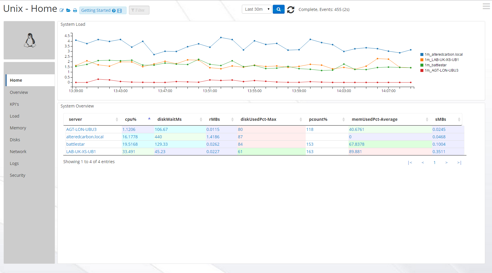
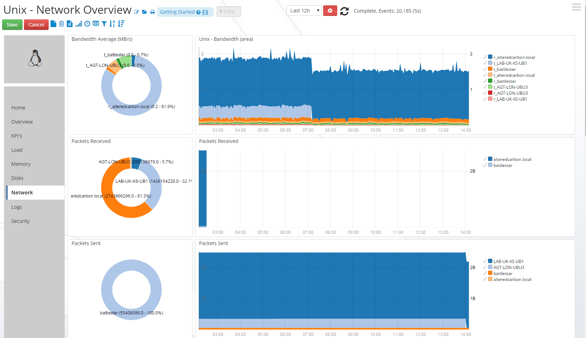
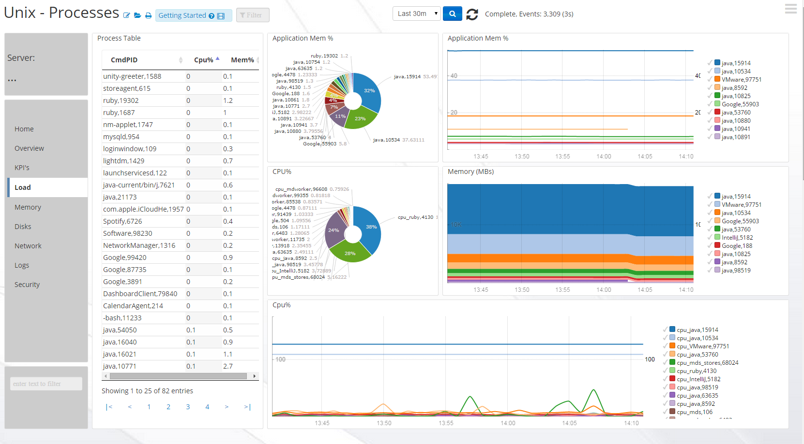

#UnixApp-1.4
##This is version of the UnixApp requires version 3 or greater, of Logscape

The UnixApps monitors disk,network and system health.

## Prequisites

The following commands should be available from the command-line. They are available in most default Linux/Unix installations. 

	sar needs to be installed.
	iostat is required for disk performance metrics 

## Downloads 

 * [UnixApp-1.4.zip](https://github.com/logscape/Unix3/blob/master/UnixApp-1.4.zip?raw=true)
 * [Example Properties File ](https://github.com/logscape/unixapp/raw/master/dist/UnixApp-1.1-override.properties)

## Overview

The home page gives you an estate wide view of your servers performance and health. Identify quickly when your servers are struggling under load. 

 

## Network Throughput 

 
## Process Activity  

 
